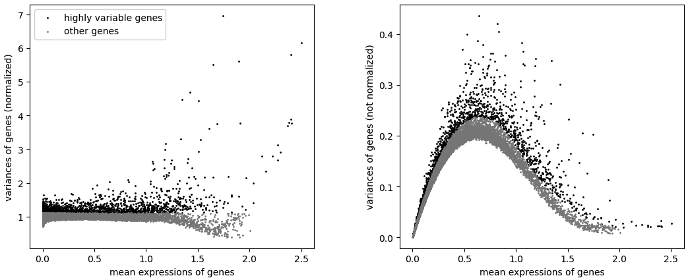
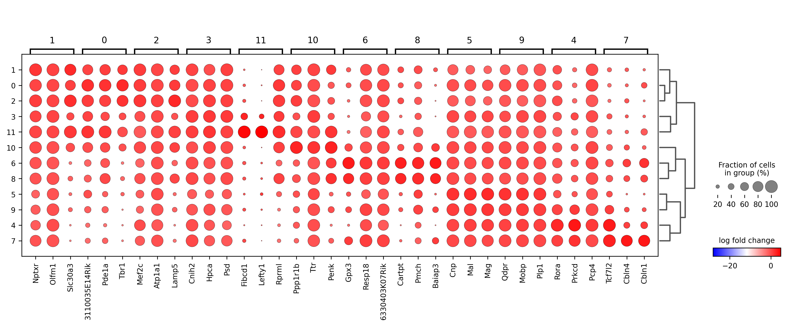

# spatial-transcriptomic-visum-pipeline
A multimodal pipeline for integrating spatial transcriptomics and computer vision using Scanpy and Squidpy.

## Project Overview
This project utilizes 10X Visium spatial transcriptomic data from the [V1 Adult Mouse Brain dataset](https://squidpy.readthedocs.io/en/stable/api.html#module-squidpy.datasets). The pipeline implements a multimodal approach, combining AI-driven image feature extraction with statistical genomics to characterize anatomical regions of the mouse brain.  

## Technical Pipeline
### 1. QC & Feature Selection
To ensure data quality, spots were filtered to include only those with at least 500 genes, and genes were retained only if expressed in at least 10 spots.

*Figure: QC metrics for total UMI counts and mitochondrial gene percentage. The low MT% indicates high-quality tissue preservation.*

The data was normalized and log-transformed to identify 2,000 Highly Variable Genes (HVGs) using the Seurat flavor, focusing the analysis on genes most likely to drive biological differences.

*Figure: Left: Comparison of highly variable genes after normalization. Right: Without normalization*

### 2. Spatial Clustering & Annotation
I applied the Leiden algorithm for unsupervised clustering. The high-dimensional gene expression data was reduced via PCA and visualized using UMAP.

*Figure: Left: UMAP projection showing 11 distinct clusters. Right: Spatial mapping of clusters, showing high correspondence with anatomical structures.*

### 3. Marker Gene Identification
Differentially expressed genes were ranked using the Wilcoxon rank-sum test. This step provides the biological "fingerprint" for each spatial cluster.

*Figure: Dotplot visualizing the expression of top marker genes across clusters. The dot size represents the percentage of cells expressing the gene, and the color intensity reflects the average expression level*

### 4. Image Feature Extraction & Multimodal Correlation
A key highlight of this pipeline is the integration of morphological data. Using Squidpy, I extracted Haralick texture features (e.g., contrast, homogeneity) directly from the H&E stained tissue image.

I then performed a Pearson correlation analysis between specific marker genes and these image features to investigate the link between "visual texture" and "molecular signature."

*Figure 5: Heatmap showing correlations between key marker genes and image textures.*

### 5. Spatial Autocorrelation
Finally, I calculated Moran’s I statistics to identify Spatially Variable Genes (SVGs). Unlike standard HVGs, SVGs are identified based on their spatial grouping, helping to define sharp tissue boundaries and gradients.

## Key Insights
- Morphological Linking: The pipeline demonstrates that AI-extracted image features can serve as a proxy for biological state, providing a bridge between digital pathology and genomics.

## Requirements
### 1. Pacakges Installation
The environment can be reproduced using the provided requirements.txt file.
`pip install -r requirements.txt`

### 2. Data download
An automated Python script is provided to download the dataset and save it locally as an .h5ad file. This ensures consistent data handling across different environments. You can find the script at: `scripts/download_data.py`.

`python scripts/download_data.py`